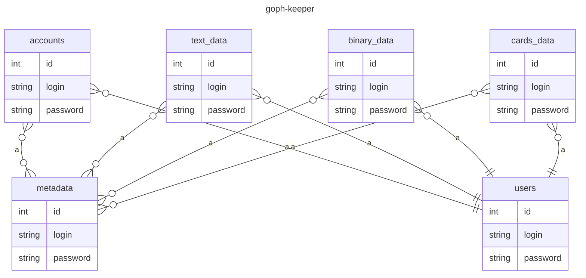

```mermaid
---
title: goph-keeper
---
erDiagram
    users{
        int id
        string login
        string password
    }

    accounts{
        int id
        string login
        string password
        }
    text_data{
        int id
        string login
        string password
        }
    binary_data{
        int id
        string login
        string password
    }
    cards_data{
        int id
        string login
        string password
        }
    metadata{
        int id
        string login
        string password
        }

    accounts }o--o{ metadata : a
    text_data }o--o{ metadata : a
    binary_data }o--o{ metadata : a
    cards_data }o--o{ metadata : a

    accounts }o--|| users : a
    text_data }o--|| users : a
    binary_data }o--|| users : a
    cards_data }o--|| users : a
    
```
