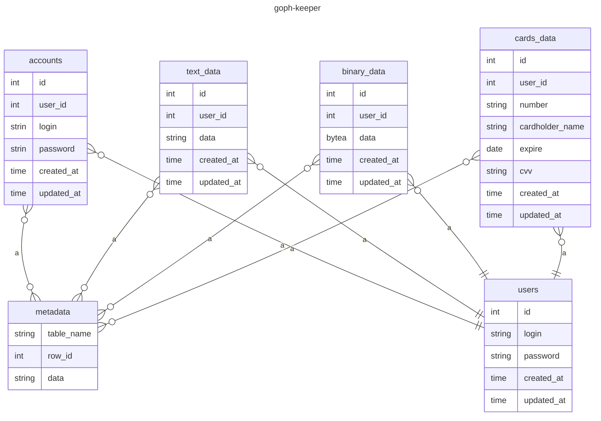

```mermaid
---
title: goph-keeper
---
erDiagram
    users{
        int id

        string login
        string password

        time created_at
        time updated_at 
    }

    accounts{
        int id
        int user_id

        strin login 
        strin password 

        time created_at
        time updated_at
        }

    text_data{
        int id
        int user_id

        string data

        time created_at
        time updated_at

        }

    binary_data{
        int id
        int user_id

        bytea data

        time created_at
        time updated_at

    }
    cards_data{
        int id
        int user_id

        string number
        string cardholder_name
        date expire
        string cvv 

        time created_at
        time updated_at
        }

    metadata{
        string table_name
        int row_id 

        string data 
        }

    accounts }o--o{ metadata : a
    text_data }o--o{ metadata : a
    binary_data }o--o{ metadata : a
    cards_data }o--o{ metadata : a

    accounts }o--|| users : a
    text_data }o--|| users : a
    binary_data }o--|| users : a
    cards_data }o--|| users : a
    
```