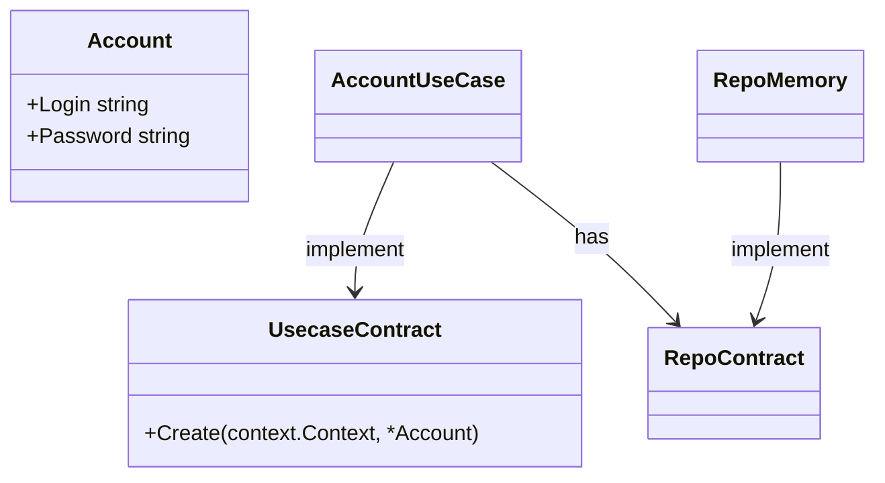

# Диаграмма классов

## Account

```mermaid
classDiagram

class Account { 
    +Login string
    +Password string
}

class UsecaseContract { 
    +Create(context.Context, *Account)
}

class AccountUseCase { }

AccountUseCase --> UsecaseContract : implement

class RepoContract { }

class RepoMemory { }

RepoMemory --> RepoContract : implement

AccountUseCase --> RepoContract : has

```
