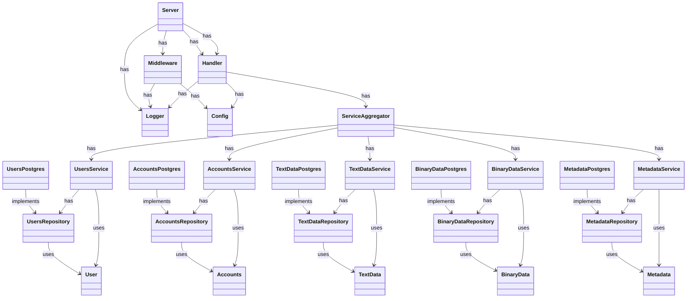

# Диаграмма классов

# Описание
## Server
- Назначение
    - Инициализовать и запустить сервер

## Middleware
- Назначение
    - Логгировать запросы
    - Прозводить аутентификацию пользователя

## Handler
- Назначение
    - Обрабатывать входящие запросы

## ServiceAggregator
- Назначение
    - Централизовать и сделать атомарными функции для работы с данными
